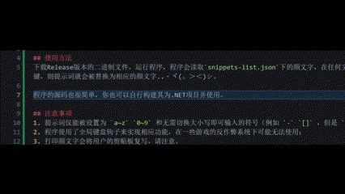

# Kaomoji-Snippet
这是一个颜文字快速输出工具，打开该程序后，输入特定的提示词，按下`Ctrl`键，程序就会立刻将输入的提示词替换为设定好的颜文字。

## 使用方法
下载Release版本的二进制文件，运行程序，程序会读取`snippets-list.json`下的颜文字，在任何文本框中打出`snippets-list.json`的提示词内容，按下Ctrl键，则提示词就会被替换为相应的颜文字..・ヾ(。＞＜)シ。

程序的源码也很简单，你也可以自行构建其为.NET项目并使用。

(*≧∀≦*) Ｏ(≧▽≦)Ｏ 〒.〒 (・人・)

## 注意事项
1. 提示词仅能被设置为 `a~z` `0~9` 和无需切换大小写即可输入的符号（例如 `-` `[]` ，但是 `_` 不行）；
2. 程序使用了全局键盘钩子来实现相应功能，在一些游戏的反作弊系统下可能无法使用；
3. 打印颜文字会将用户的剪贴板复写，请注意。

## 构建依赖
程序使用了下方的Nuget包，在此引出
- Newtonsoft.Json
- SharpHook
- TextCopy